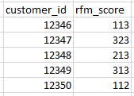
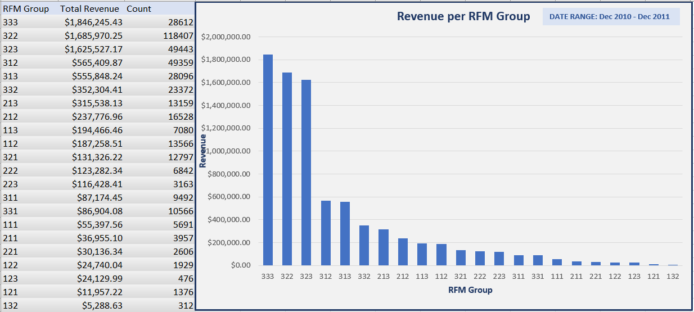
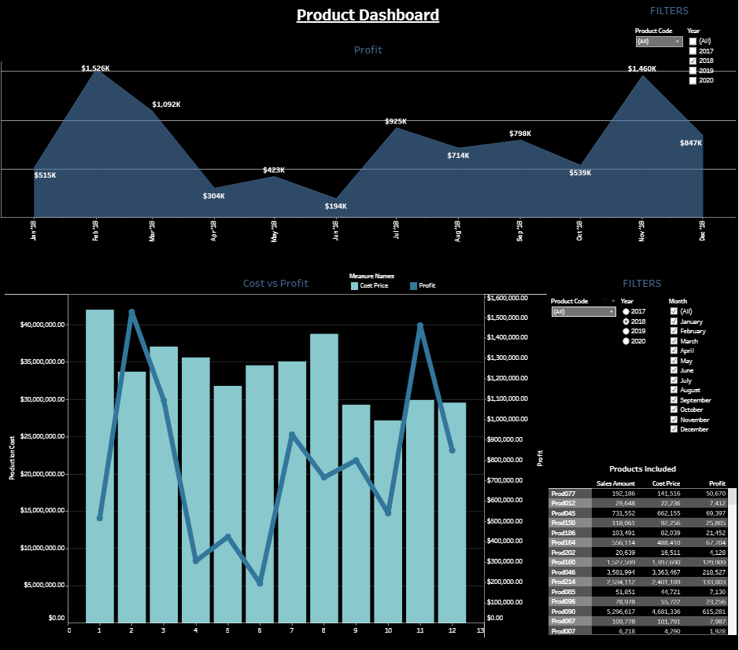

# Derek_Portfolio
View a snapshot of tools and documents I have developed in my projects. 

## Business Analyst Documentation
*Tools Used:*
  - MS Visio
  - GitLab
  - draw.io

I created this workflow process while working with Dark Jellyfish Web Development. 
Stakeholders Include:
  - 2 business owners
  - Full Stack Developer
  - Project Manager (me)

### Example Use Case
To connect the administration page and resources page, I wrote this [Use Case](https://github.com/frankd123/Derek_Portfolio/blob/main/images/Use%20Case_Admin%20Links.PNG) and attached this [Wireframe](https://github.com/frankd123/Derek_Portfolio/blob/main/images/LCL_Knife_Resources_Page_Layout_1.3.pdf)

### Wireframes
[Index Page Wireframe](https://github.com/frankd123/Derek_Portfolio/blob/main/images/LCL%20Knife%20Index%20Layout%201.3.pdf)

[Store Page Wireframe](https://github.com/frankd123/Derek_Portfolio/blob/main/images/LCL%20Knife%20Store%20Page%20Layout%201.5.pdf)

### ER Diagram
I took an online class on relational database management systems (MYSQL) and created this [Entity Relationship Diagram](https://github.com/frankd123/Derek_Portfolio/blob/main/images/The%20Office%20Entity%20Relationship%20Diagram.pdf)

## [Project 1: E-Commerce Customer RFM Scores](https://github.com/frankd123/RFM_Scores)
*click title to view repo*

### Objectives:
* Improve the marketing team's efficiency and accuracy on future targeted promotions
* Allow marketing team to segment customers based on purchase behavior
* Created RFM scores using MYSQL and EXCEL for each individual customer ID

**Further development possibilities**

If this dataset was consistently being updated I would:
* Create triggers to update column data and filter out any rows without sufficient data
* Create stored procedures to update views
* Create events to schedule execution of stored procedures

## [Project 2: Product Dashboard](https://public.tableau.com/views/ProductDashboard_16314197128400/Dashboard1?:language=en-US&:display_count=n&:origin=viz_share_link)
*click title to interact with dashboard in Tableau Public*

### Objectives:
This dashboard allows management and teams to monitor the product cost to the business and profits. The two charts allow for easy comparison based on filterable products and date ranges. The table in the bottom right features a summary of the selected products in the bottom chart. 

## Project Proposal: Template Submission Inefficiencies

At my current place of employment (inbound customer service calling center), we have multiple forms to manually submit via email and I outline in the following document how this method causes inconsistencies and takes more time than is necessary. This document is used to convince management to collect data and analyze this process to accurately asses the need for restructuring the process as I do not have access to company data from my current position. 

[Template submission Inefficiencies Document](https://github.com/frankd123/Derek_Portfolio/blob/main/images/Template%20Submission%20Inefficiencies%20CCI.pdf)

