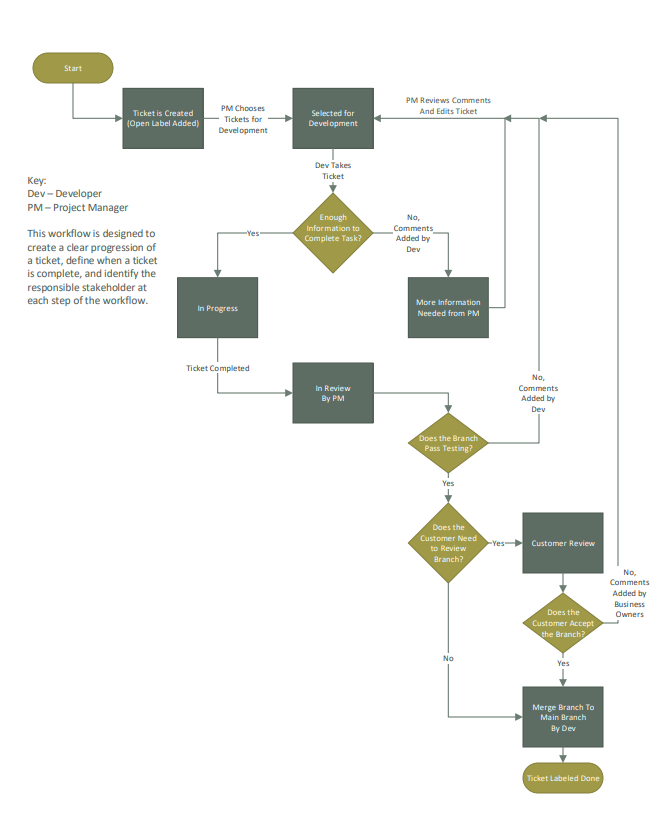

# Derek_Portfolio
View a snapshot of tools and documents I have developed in my projects.

## [Website Redesign for LCL Knives Documentation]()

### Project Objectives
- **Increase sales by simplifying and condensing the user experience**
- Decrease user bounce rate by reducing page loading time to less than 1 second
- Streamline user experience by condensing website architecture

### Project Outcomes
- Reduced page load time by more than 60 seconds by reducing number of images per page, file compression, and changing storage system
- Reduced website structure by 65% from 20 to 7 web pages by combining similar webpages and condensing content

### **click on image to view more screenshots**

*Image below* outlines the workflow and defines when a ticket is complete. 

[**Website Structure Diagram** - Current and Future State](https://github.com/frankd123/Derek_Portfolio/blob/main/images/Current%20and%20Future%20State%20Diagram.pdf)

### Wireframes for website design
[**Wireframe** - Index Page](https://github.com/frankd123/Derek_Portfolio/blob/main/images/LCL%20Knife%20Index%20Layout%201.3.pdf)

[**Wireframe** - Store Page](https://github.com/frankd123/Derek_Portfolio/blob/main/images/LCL%20Knife%20Store%20Page%20Layout%201.5.pdf)

*Tools Used:*
  - MS Visio
  - GitLab
  - draw.io
 
 

## [Car Purchase Analysis]()

### Project Objectives: 
- **Analyze cost per month for current car**
- Risk analysis of different car purchasing scenarios

### Outcome
- **Saving 10% on car payments by analyzing financial data in Excel and recommending the options with least financial risk.**

*Tools Used:*
- Excel

## [Personal Finance Dashboard]()

### Project Objectives
- **Track all unique transactions and recurring payments**
- Track transaction categories to find most costly categories
- Automate data cleaning in SQL database with stored procedures

### Project Outcome
- **Saved over $500 in the last year by identifying 5 unused monthly and yearly subscriptions.** 

*Tools Used:*
- SQL
- Tableau

## [Customer Segmentation Analysis, E-Commerce](https://github.com/frankd123/RFM_Scores)
*click title to view SQL query*

### Project Objectives:
- **Increase customer interaction with promotions by segmenting customers based on purchase behavior**
- Segment customers by RFM scores (recency, frequency, monetary) produced using SQL
- Built SQL database to collect transaction data, clean data, purchase and customer analysis, assign RFM scores
- Visualization created in Excel

### About RFM Scores:
To create an RFM score, each customer gets a score for the recentcy of last putchase, the frequency of purchases, and the average monetary value of each purchase. The customer will receive a score of 1-3 (3 being the most profitable number) for each category and those three numbers are put together to create a single three digit number. Every combination of these numbers represents a group of customers with similar purchase habits. 

*Tools Used:*
- MYSQL
- Excel

**Further development possibilities**

* Build dashboards to moniter interaction of customer interaction during marketing campaigns
* Create triggers to update column data and filter out any rows without sufficient data
* Make running the queries more light weight in their execution

## [Gilbert Survey Results Dashboard](https://public.tableau.com/app/profile/derek.frank2259/viz/GilbertAmbulanceServicesSurvey/Dashboard1)
*click title to interact with dashboard in Tableau Public*

### Project Objectives:
- **Prioritize the budget of Gilbert Fire and Rescue's ambulance service based on community input**
- Filter through community comments using keywords

*Tools Used:*
- Tableau

## Other Documents

[**Entity Relationship Diagram**](https://github.com/frankd123/Derek_Portfolio/blob/main/images/The%20Office%20Entity%20Relationship%20Diagram.pdf)

